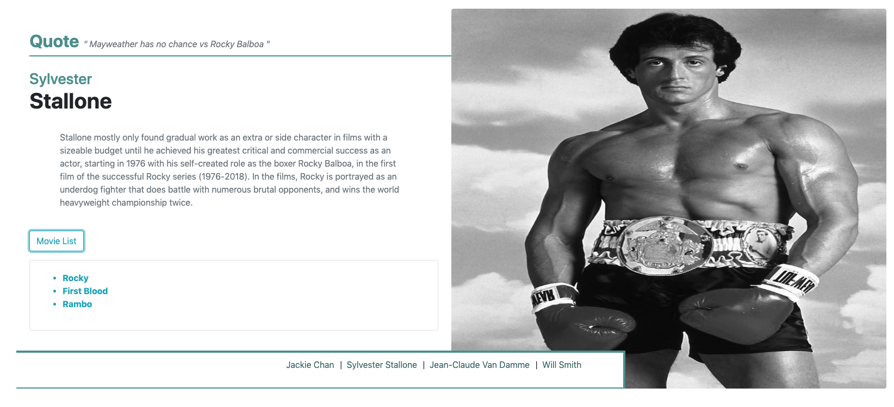

# Movie Stars using Pug

More information on Pug can be found here:
[Pug](https://pugjs.org/api/getting-started.html)

Server.js is reading from the data from actors.json file. I'm rendering the front end with Pug and bootstrap. 

Movie list button is a bootstrap button that expanse when clicked on. 

*Screenshot example:*

